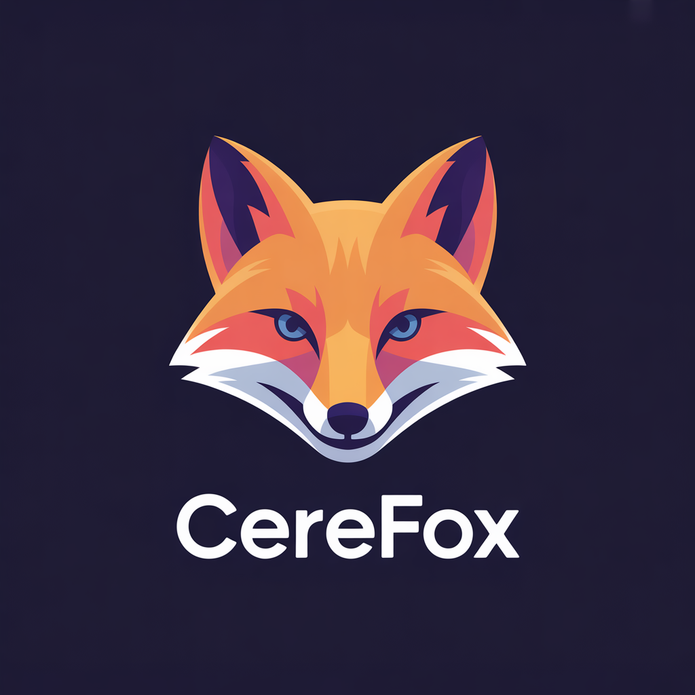

<p align="center">
  
</p>

# Cerefox

**Personal second-brain knowledge base** — store your notes, thoughts, and documents in Postgres with pgvector and query them from any AI agent via MCP.

[](LICENSE)
[](https://python.org)

---

## What is Cerefox?

Cerefox is a self-hosted knowledge base for individuals who want to:

- **Own their data** — everything lives in a Postgres database you control
- **Search semantically** — hybrid full-text + vector search finds relevant notes even with fuzzy queries
- **Connect AI agents** — Claude, Cursor, and any MCP-compatible agent can read and write your knowledge base
- **Ingest anything** — markdown files, PDFs, DOCX, or paste directly from the CLI or web UI
- **Keep it cheap** — Supabase free tier + low-cost cloud embeddings; see `docs/guides/operational-cost.md`

---

## Features

| Feature | Details |
|---------|---------|
| **Hybrid search** | Combines full-text (BM25) + semantic (vector) search with a configurable alpha weight |
| **Heading-aware chunking** | H1 > H2 > H3 hierarchy; each heading section is a chunk with breadcrumb context |
| **Cloud embeddings** | OpenAI `text-embedding-3-small` (768-dim) via API — or swap to Fireworks AI |
| **Built-in MCP server** | `cerefox mcp` stdio server works with Claude Desktop, ChatGPT Desktop, Cursor, Claude Code |
| **Web UI** | FastAPI + Jinja2 + HTMX dashboard for browsing, searching, and ingesting |
| **Multi-format ingest** | `.md`, `.txt`, `.pdf` (pypdf), `.docx` (python-docx) |
| **Batch ingest** | `cerefox ingest-dir` recurses directories |
| **Deduplication** | SHA-256 content hash; re-ingesting the same file is a no-op |
| **Backup and restore** | JSON snapshots, optional git commit |
| **Small-to-big retrieval** | `cerefox_context_expand` RPC returns chunk neighbours for richer context |

---

## Getting Started

### 1. Clone and install

```bash
git clone https://github.com/yourname/cerefox.git
cd cerefox
uv sync
```

### 2. Set up Supabase (free)

1. Sign up at [supabase.com](https://supabase.com) — a GitHub login works fine.
2. Create a new project. Give it a name (e.g. `cerefox`) and set a database password (store it somewhere safe — you'll need it once).
3. On the project creation screen leave the defaults:
   - **Enable Data API** ✅ — required (the Python client uses this)
   - **Enable automatic RLS** — leave unchecked (single-user app, not needed)

### 3. Configure `.env`

```bash
cp .env.example .env
```

Open `.env` and fill in these values:

| Variable | Where to find it |
|---|---|
| `CEREFOX_SUPABASE_URL` | Supabase → Settings → API → Project URL |
| `CEREFOX_SUPABASE_KEY` | Supabase → Settings → API → Secret keys → `default` |
| `CEREFOX_DATABASE_URL` | Supabase → Settings → Database → Connection string → **Session pooler** (port 5432) |
| `OPENAI_API_KEY` | [platform.openai.com/api-keys](https://platform.openai.com/api-keys) |

**`CEREFOX_DATABASE_URL` notes:**
- Use the **Session pooler** string (port 5432), not the Direct connection or Transaction pooler.
- The username must include your project ref: `postgres.your-project-ref` — not just `postgres`.
- Direct connection is IPv6 only on the free tier. If you get `nodename nor servname provided`, you are on IPv4 — use the Session pooler.
- See `.env.example` for both URL formats with full explanations.

### 4. Deploy the schema

```bash
uv run python scripts/db_deploy.py
```

### 5. Ingest a document and open the web UI

```bash
uv run cerefox ingest my-notes.md --title "My notes"
uv run cerefox web                # → http://localhost:8000
```

Full guide: `docs/guides/quickstart.md`

---

## Architecture

```
cerefox_documents     cerefox_chunks
─────────────────     ───────────────────────────────
id, title, source     id, document_id, chunk_index
content_hash          heading_path, heading_level
project_id            content, char_count
metadata (JSONB)      embedding_primary (VECTOR 768)
chunk_count           fts (TSVECTOR, generated)
```

Search RPCs (MCP tools): `cerefox_hybrid_search`, `cerefox_fts_search`,
`cerefox_semantic_search`, `cerefox_search_docs`, `cerefox_reconstruct_doc`,
`cerefox_context_expand`, `cerefox_save_note`

---

## Connecting AI agents

Add to `~/Library/Application Support/Claude/claude_desktop_config.json` (same format for ChatGPT Desktop and Cursor):

```json
{
  "mcpServers": {
    "cerefox": {
      "command": "uv",
      "args": ["--directory", "/path/to/cerefox", "run", "cerefox", "mcp"]
    }
  }
}
```

For cloud ChatGPT, use the Supabase Edge Functions as GPT Actions. Full guide: `docs/guides/connect-agents.md`

---

## Documentation

| Guide | Description |
|-------|-------------|
| `docs/guides/quickstart.md` | Zero to first document in 15 minutes |
| `docs/guides/setup-supabase.md` | Supabase project setup |
| `docs/guides/configuration.md` | All configuration options |
| `docs/guides/connect-agents.md` | MCP agent integration |
| `docs/guides/setup-local.md` | Local Docker setup |
| `docs/guides/ops-scripts.md` | Backup, restore, migrate |
| `docs/guides/setup-cloud-run.md` | Google Cloud Run deployment |
| `docs/guides/operational-cost.md` | Cost breakdown for all deployment options |
| `docs/guides/contributing.md` | Adding embedders, converters, commands |

---

## License

MIT — see LICENSE.
